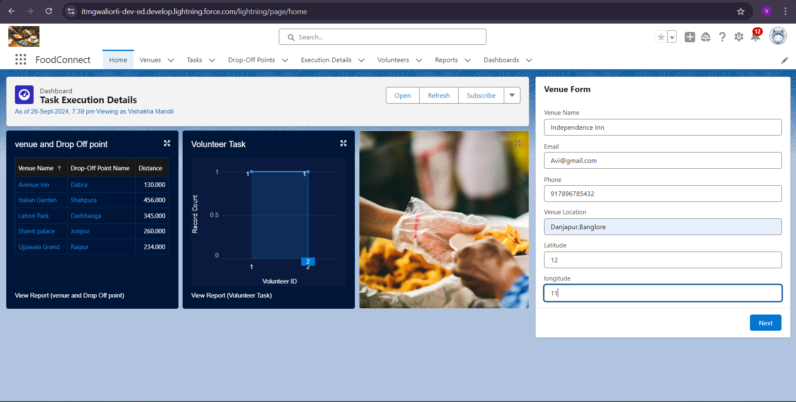
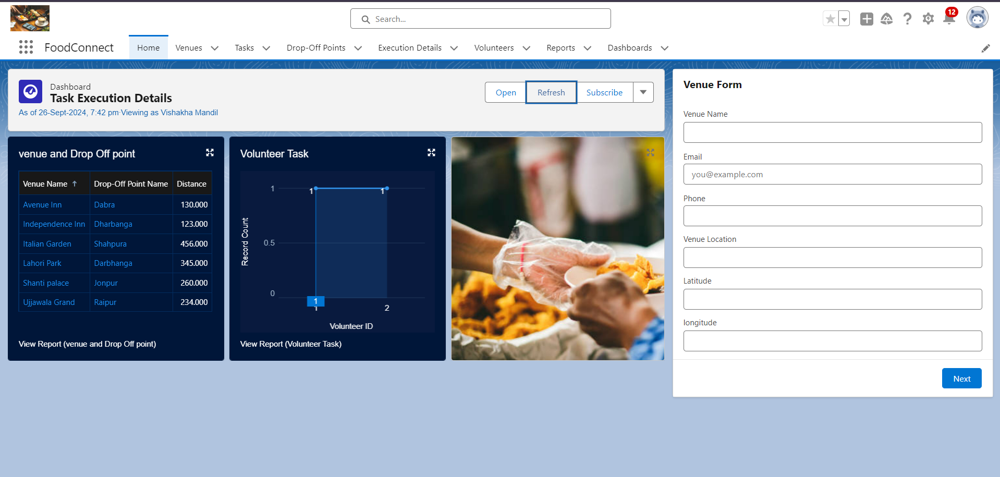

# FoodConnect

## Project Overview
FoodConnect is a Salesforce application designed to efficiently supply leftover food to those in need. The project facilitates connections between venues and volunteers, enabling effective food distribution management. It includes custom objects, fields, automation flows, and reporting features to streamline operations and enhance user engagement. This repository contains the implementation steps, configurations, and essential components to replicate the application in a Salesforce environment.
https://drive.google.com/drive/folders/1NJKrBQUO2qgBrewQwWRyJLev9OjYhFrA
## Implementation Steps
**Account Creation** : Set up a Salesforce Developer account.

**Object Creation** : Created custom objects: Venue, Drop-Off Point, Task, Volunteer, and Execution Details, with lookup relationships between them.

**Custom Tabs**: Added custom tabs for each object to improve navigation.

**Lightning App**: Built the FoodConnect Lightning App to manage the objects and processes within a single app interface.

**Fields Creation**: Created necessary fields such as Distance Calculation, task details, and volunteer information.

**Flow**: Set up automation using a flow to assign tasks to volunteers based on availability and location.

**Trigger**: Developed a trigger to auto-update records when tasks are marked complete.

**User Creation**: Created users with specific roles to manage food donations and distribution.

**Public Groups**: Created groups like Iksha, NSS, and Street Cause for sharing records based on distance criteria.

**Report Types**: Defined custom report types to track volunteers, tasks, and execution details.

**Reports**: Generated reports to monitor volunteer assignments, task progress, and food deliveries.

**Dashboards**: Created dashboards to visualize real-time data on food distribution performance, volunteer activity, and task status.

**Sharing Rules**: Applied sharing rules based on the Distance Calculation field to grant access to relevant public groups.

**Home Page Customization**: Customized the home page to display key metrics, reports, and dashboards for users.

## Screenshots

## How to Set Up the Project
**1)Clone the repository**:

https://github.com/VishakhaMandil/FoodConnect.git

Follow the implementation steps outlined above to replicate the project setup in your Salesforce environment.

## Contribution
Feel free to contribute to this project by creating issues or submitting pull requests. Your feedback and contributions are welcome!
